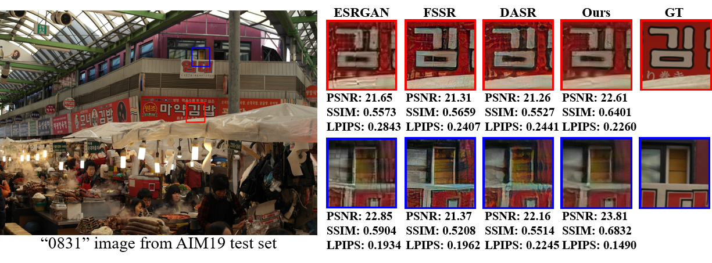
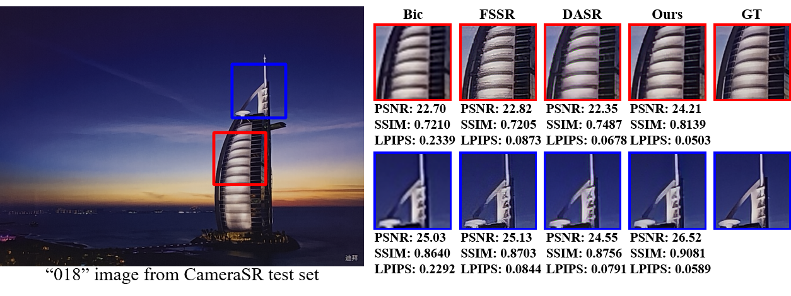

# RWSR-EDL 

Real-World Super-Resolution by Exclusionary Dual-Learning (TMM 2022)[arxiv](https://arxiv.org/abs/2206.02609)

Hao Li, Jinghui Qin, Zhijing Yang, Pengxu Wei, Jinshan Pan, Liang Lin, Yukai Shi

*Guangdong University of Technology, Sun Yat-sen University, Nanjing University of Science and Technology*

(*Official PyTorch Implementation*)

## Update - June, 2022
- Release training code.

## Introduction

Real-world image super-resolution is a practical image restoration problem that aims to obtain high-quality images from in-the-wild input, has recently received considerable attention with regard to its tremendous application potentials. Although deep learning-based methods have achieved promising restoration quality on real-world image super-resolution datasets, they ignore the relationship between L1- and perceptual- minimization and roughly adopt auxiliary large-scale datasets for pre-training. In this paper, we discuss the image types within a corrupted image and the property of perceptual- and Euclidean- based evaluation protocols. Then we propose an exclusionary dual-learning strategy to address the feature diversity in perceptual- and L1- based cooperative learning. Moreover, a noise-guidance data collection strategy is developed to address the training time consumption in multiple datasets optimization. When an auxiliary dataset is incorporated, our proposed framework achieves promising results and repulses any training time increment by adopting the noise-guidance data collection strategy. Extensive experiments show that our model achieves competitive performance over state-of-the-art methods on four in-the-wild image super-resolution datasets.  

  

If you are interested in this work, please cite our paper.

    @article{Li_2022_TMM,
             author = {Li, Hao and Qin, Jinghui and Yang, Zhijing and Wei, Pengxu and Pan, Jinshan and Lin, Liang and Shi, Yukai},
             title = {Real-World Super-Resolution by Exclusionary Dual-Learning},
             journal = {IEEE Transactions on Multimedia},
             year = {2022}
         }

## Visual Results







## Dependencies and Installation
This code is based on [BasicSR](https://github.com/xinntao/BasicSR).

- Python 3 (Recommend to use [Anaconda](https://www.anaconda.com/download/#linux))
- [PyTorch >= 1.0](https://pytorch.org/)
- NVIDIA GPU + [CUDA](https://developer.nvidia.com/cuda-downloads)
- Python packages: `pip install numpy opencv-python lmdb pyyaml lpips`
- TensorBoard: 
  - PyTorch >= 1.1: `pip install tb-nightly future`
  - PyTorch == 1.0: `pip install tensorboardX`

<!-- ## Testing
Download dataset from [NTIRE 2020 RWSR](https://competitions.codalab.org/competitions/22220#participate) and unzip it to your path.

```cd ./codes```

 1. Modify the configuration file options/df2k/test_df2k.yml
     - line 1 : 'name' -- dir name for saving the testing results
     - line 13 : 'dataroot_LR' -- test images dir
     - line 26 : 'pretrain_model_G' -- pre-trained model for testing
 2. Run command :
 ```CUDA_VISIBLE_DEVICES=X python3 test.py -opt options/df2k/test_df2k.yml ```
 3. The output images is saved in '../results/' -->

## Training

 1. prepare training data
    - specify dataset paths in './preprocess/path.yml' and create bicubic dataset :
    ```python3 ./preprocess/create_bicubic_dataset.py --dataset df2k --artifacts tdsr```

    - run the below command to collect high frequency noise from Source :
    ```python3 ./preprocess/collect_noise.py --dataset df2k --artifacts tdsr```
    
 2. train SR model
    - Modify the configuration file options/df2k/train_bicubic_noise.yml
    - Run command :
    ```CUDA_VISIBLE_DEVICES=4,5,6,7 python3 train.py -opt options/df2k/train_ntire.yml```
    - checkpoint dir is in '../experiments'
    
